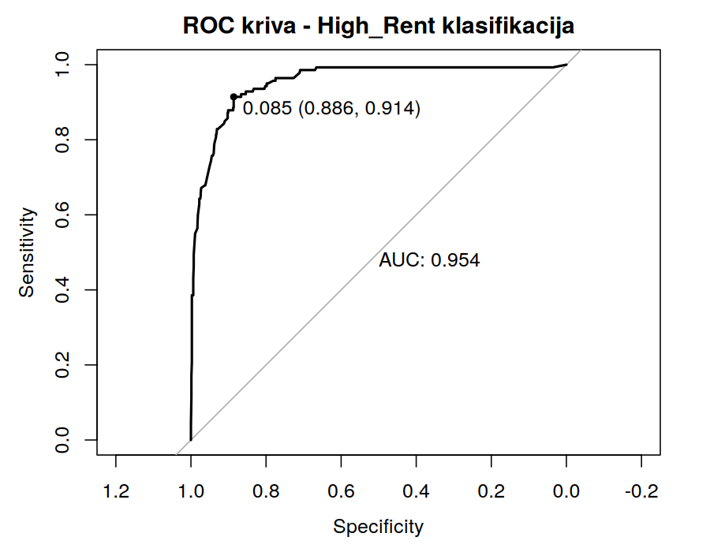
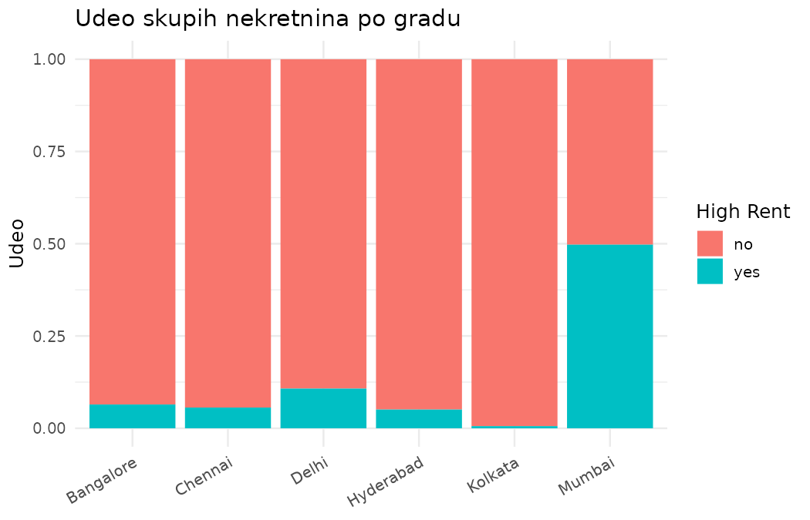

# Predikcija skupih nekretnina za izdavanje (Naive Bayes)

Klasifikacioni projekat u R-u: da li oglas za izdavanje stana, na osnovu
svojih strukturnih karakteristika (grad, površina, broj soba/kupatila,
opremljenost...), spada u gornjih 15% po ceni kirije na tržištu — bez
poznavanja tačne cene. Model je Naive Bayes sa diskretizovanim numeričkim
prediktorima, a prag odluke je dodatno optimizovan preko ROC krive
(Youden-ov kriterijum).

Ovo je pre svega vežba metodologije klasifikacije (čišćenje podataka →
EDA → priprema za model → treniranje → evaluacija → tuning praga), rađena
na javno dostupnom skupu podataka. Isti pristup — segmentacija oglasa po
cenovnom nivou na osnovu strukture, ne cene — bi realno mogao poslužiti
platformi za izdavanje nekretnina za automatsko tagovanje "premium"
oglasa ili kao signal za proveru oglasa čija je upisana cena neočekivano
niska za date karakteristike.

**[→ Pogledaj pun izveštaj (analysis.html)](analysis.html)**

## Rezultati

| Prag odluke | Accuracy | Precision | Recall | F1 |
|---|---|---|---|---|
| 0.5 (podrazumevani) | 92.4% | 89.5% | 55.0% | 68.1% |
| 0.085 (Youden) | 89.0% | 58.2% | 91.4% | 71.1% |

**AUC = 0.954** — model vrlo dobro razdvaja skupe od jeftinijih
nekretnina nezavisno od izabranog praga; pitanje je samo gde postaviti
granicu u zavisnosti od toga da li je važnije ne propustiti nijedan
premium oglas (viši recall) ili biti siguran da je sve što je označeno
kao premium zaista premium (viši precision).

<p align="center">
  
  
</p>

Grad je najizraženiji prediktor: dok u pet od šest gradova skupe
nekretnine čine ispod 12% oglasa, u Mumbaiju je taj udeo blizu 50%.

## Podaci

[House Rent Prediction Dataset](https://www.kaggle.com/datasets/iamsouravbanerjee/house-rent-prediction-dataset)
(Kaggle) — 4746 oglasa za izdavanje stanova u šest indijskih gradova
(Mumbai, Chennai, Bangalore, Hyderabad, Delhi, Kolkata), sa atributima
poput površine, broja soba i kupatila, opremljenosti, preferiranog
zakupca i tipa kontakta.

## Struktura projekta

```
rent-price-classifier/
├── analysis.Rmd          # glavni izveštaj sa punim narativom
├── analysis.html         # renderovan izveštaj (otvoriti direktno u browseru)
├── data/
│   ├── README.md          # uputstvo za preuzimanje dataset-a
│   └── rent.csv           # (nije u repo-u, vidi data/README.md)
├── R/
│   ├── utils.R            # get_evaluation_metrics(), quantile_discretize_df()
│   ├── 01_data_cleaning.R # load_and_clean_rent_data()
│   ├── 02_eda.R           # generate_eda_plots(), save_eda_plots()
│   └── 03_modeling.R      # train/test split, Naive Bayes, ROC, threshold tuning
└── figures/                # sačuvani grafici (EDA + ROC kriva)
```

## Pokretanje

1. Preuzmi `rent.csv` sa [Kaggle-a](https://www.kaggle.com/datasets/iamsouravbanerjee/house-rent-prediction-dataset)
   i sačuvaj ga kao `data/rent.csv` (dataset nije uključen u repo — vidi
   [`data/README.md`](data/README.md)).
2. Instaliraj pakete i renderuj izveštaj:

```r
install.packages(c("ggplot2", "e1071", "caret", "pROC", "here",
                    "rmarkdown", "knitr"))
rmarkdown::render("analysis.Rmd")
```

Svaka faza je izdvojena kao funkcija u `R/` folderu (`load_and_clean_rent_data()`,
`generate_eda_plots()`, `train_naive_bayes()`, `compute_roc()`, ...), pa se
pipeline može pozivati i direktno iz konzole, ne samo kroz `analysis.Rmd`.

### Napomena o zavisnostima

Originalna verzija ove analize je za diskretizaciju numeričkih promenljivih
koristila `bnlearn::discretize()`. U `R/utils.R` je ista logika (podela na
intervale jednake frekvencije) implementirana direktno preko `quantile()` i
`cut()` iz base R-a — jedna manja zavisnost za ceo projekat, bez promene
rezultata.

## Ograničenja

Prag od 85. percentila za definisanje "high rent" klase je izbor napravljen
za potrebe ove vežbe, a ne nešto izvedeno iz poslovnog zahteva. Podaci su iz
2022. godine i pokrivaju samo šest gradova, pa se model ne može
generalizovati van tog konteksta bez ponovnog treniranja.

## Licenca

[MIT](LICENSE)
